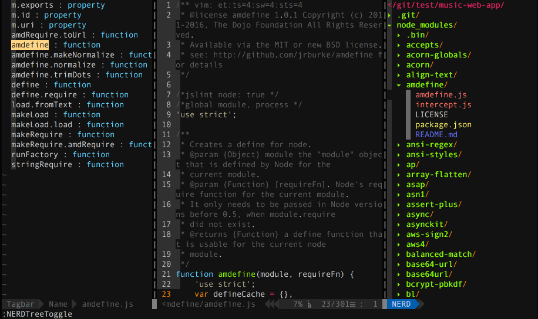

vim-web
===

Only tested on Mac OSx



## 目录

- [安装](#安装)
- [插件管理](#插件管理)
  - [安装插件](#安装插件)
  - [更新插件](#更新插件)
  - [卸载插件](#卸载插件)
- [启动Vim](#启动vim)
- [常用快捷键](#常用快捷键)
- [基础使用](#基础使用)
  - [快捷键通配符](#快捷键通配符)
  - [插入命令](#插入命令)
  - [定位命令](#定位命令)
  - [复制剪切](#复制剪切)
  - [简单排版](#简单排版)
  - [保存退出](#保存退出)
  - [整页翻页](#整页翻页)
  - [替换](#替换)
    - [替换取消](#替换取消)
    - [快捷替换](#快捷替换)
    - [精确替换](#精确替换)
  - [开关注释](#开关注释)
  - [工程文件菜单](#工程文件菜单)
  - [Tab操作](#tab操作)
  - [HTML操作](#HTML操作)
- [搜索查找](#搜索查找)
  - [文件搜索](#文件搜索)
  - [搜索文本内容](#搜索文本内容)
  - [快速移动](#快速移动)
- [插件说明](#插件说明)
  - [主题风格](#主题风格)
  - [使用界面](#使用界面)
  - [管理项目](#管理项目)
  - [代码书写](#代码书写)
  - [代码阅读](#代码阅读)
- [参考资料](#参考资料)

## 安装

最新版本的Vim 7.4+  使用(`brew install macvim`)安装，vim 版本更新 `brew install macvim --override-system-vim`

```shell
$ git clone https://github.com/jaywcjlove/vim-web.git ~/.vim
$ ln -s ~/.vim/.vimrc ~/.vimrc

# 上面执行完成之后
# 开始下载安装插件
$ vim # 在vim中运行 ":PlugInstall"

# 上面插件安装完成之后执行下面内容
# command-t 文件搜索插件安装
$ cd ~/.vim/plugged/command-t 
$ rake make

# 搜索文本内容工具
# 需要安装 CtrlSF的依赖ripgrep
$ brew install ripgrep

# 代码提示插件也需要你运行安装哦，不然没有效果嘞
cd ~/.vim/plugged/YouCompleteMe
./install 
```

**注：** 默认已经安装了前端必备插件。`.vimrc` 是控制 vim 行为的配置文件，位于 ~/.vimrc，不论 vim 窗口外观、显示字体，还是操作方式、快捷键、插件属性均可通过编辑该配置文件将 vim 调教成最适合你的编辑器。

### 查看配置位置

```
# 进入vim输入下面字符
:echo $MYVIMRC
```

## 插件管理

这里面刚开始使用的Vim插件管理工具[VundleVim/Vundle.vim](https://github.com/VundleVim/Vundle.vim.git)，后面为了大家安装方便，使用了 [junegunn/vim-plug](https://github.com/junegunn/vim-plug)，这个插件管理工具，俺十分不喜欢，多了个 `autoload` 目录，安装过程也奇丑无比，安装快速，所以就使用它吧，下面命令更新安装的 `plug.vim`，默认已经有了不需要这一步。

```bash
curl -fLo ~/.vim/autoload/plug.vim --create-dirs \
    https://raw.githubusercontent.com/junegunn/vim-plug/master/plug.vim
```

### 安装插件

将配置信息其加入 `~/.vim/.vimrc` 中的`call vundle#begin()` 和 `call vundle#end()` 之间，最后进入 vim 输入下面命令，摁 `enter` 进行安装。

```shell
:PlugInstall
```

### 更新插件

插件更新频率较高，差不多每隔一个月你应该看看哪些插件有推出新版本，批量更新，只需在 vim 中执行下面命令即可。

```shell
:PlugUpdate
```

### 卸载插件

先在 .vimrc 中注释或者删除对应插件配置信息，然后在 vim 中执行下面命令，即可删除对应插件。

```shell
:PlugClean
```

## 启动Vim

```bash
$ vim
```

## 常用快捷键

这里的快捷键是我配置好的可用的。

```bash
;fl # 换出菜单列表
nw  # 窗口切换
;lw # 跳转至右方的窗口
;hw # 跳转至左方的窗口
;kw # 跳转至上方的子窗口
;jw # 跳转至下方的子窗口


# 可以直接在Tab之间切换。
gt # 后一个Tab标签
gT # 前一个Tab标签
;q # 关闭一个标签

ctrl-f # 下一页 f 就是`forword` 
ctrl-b # 上一页 b 就是`backward`  

;t # 通过搜索文件打开文件

# 快速文本内定位
;;b # 光标前代码定位
;;e # 光标后代码定位
;;f # 光标后代码定位 <搜索自负> 出现定位信息
;;F # 光标前代码定位 <搜索自负> 出现定位信息

;ilt # 设置显示／隐藏标签列表子窗口(函数列表)的快捷键。速记：identifier list by tag

0   # 行首
$   # 行尾

:r ~/git/R.js # 将文件内容导入到该文件中
:!which ls  # 找命令不推出vim运行命令
:!date      # 查看编辑时间
:r !date    # 将当前编辑时间导入当前文本光标所在行

U # 选中 - 变大写 
u # 选中 - 变小写
~ # 选中 - 变大写变小写，小写变大写

;cc # 代码注释"//"
;cm # 代码段落注释"/**/"
;ci # 注释相反，注释的取消注释，没注释的注释
;cs # 段落注释，注释每行前面加"*"
;c$ # 光标开始到行结束的位置注释
;cA # 在行尾部添加注释符"//"
;cu # 取消代码注释

za # 单个代码折叠
zM # 折叠左右代码
zR # 所有代码折叠取消

;i  # 开/关缩进可视化
>   # 代码锁进 - 选中摁尖括号
<   # 代码锁进 - 选中摁尖括号

:1,24s/header/www/g  # 第1到24行将header替换成www

<c-z>  # 退出Vim
```

## 基础使用

- `inoremap` (Insert Mode)就只在插入(insert)模式下生效
- `vnoremap` (Visual Mode)只在visual模式下生效
- `nnoremap` (Normal Mode)就在normal模式下(狂按esc后的模式)生效
- 快捷键`<c-y>,` 标示(<kbd>Ctrl</kbd><kbd>y</kbd><kbd>,</kbd>)

### 快捷键通配符

快捷键通配符 `<leader>` 相当于是一个通用的命令符，默认好像是`\`，你可以在`.vimrc`中将他改为任意一个按键，在我们这个配置我改为了冒号`;`

```
" 定义快捷键的前缀，即 <Leader>
let mapleader=";"
```

### 插入命令

```bash
a # → 在光标所在字符后插入  
A # → 在光标所在字符尾插入  
i # → 在光标所在字符前插入  
I # → 在光标所在行行首插入  
o # → 在光标下插入新行  
O # → 在光标上插入新行  
```

### 删除命令

```bash
x   # → 删除关闭所在处字符  
nx  # → 删除关闭所在处n个字符  
dd  # → 删除光标所在行，
ndd # → 删除n行  
dG  # → 删除光标所在行到文件末尾内容  
D   # → 删除光标所在处到行尾内容  
:n1,n2d # → 删除指定范围的行 如：1,2d  
```

### 定位命令

```bash
:set number   #→ 设置行号 简写set nu  
:set nonu   #→ 取消行号  
gg  #→ 到第一行  
G   #→ 到最后一行  
nG  #→ 到第n行  
:n  #→ 到第n行  
S   #→ 移至行尾  
0   #→ 移至行尾  
hjkl #→ 前下上后  

w   #→ 到下一个单词的开头  
b   #→ 与w相反  
e   #→ 到下一个单词的结尾。  
ge  #→ 与e相反  

0   #→ 到行头  
^   #→ 到本行的第一个非blank字符  
$   #→ 到行尾  
g_  #→ 到本行最后一个不是blank字符的位置。  
fa  #→ 到下一个为a的字符处，你也可以fs到下一个为s的字符。  
t,  #→ 到逗号前的第一个字符。逗号可以变成其它字符。  
3fa #→ 在当前行查找第三个出现的a。  
F 和 T → 和 f 和 t 一样，只不过是相反方向。  

zz # 将当前行置于屏幕中间（不是转载…）  
zt # 将当前行置于屏幕顶端（不是猪头~）  
zb # 底端啦~  
```

### 复制剪切

> `yy` 和 p 的组合键，或者 `dd` 和 p 的组合键

```bash
yy    # → 复制当前行  
nyy   # → 复制当前行以下n行  
dd    # → 剪切当前行  
ndd   # → 剪切当前行以下n 行  
p、P  # → 粘贴在当前光标所在行或行上  
2dd   # → 删除2行  
3p    # → 粘贴文本3次  
```

### 简单排版

```bash
:ce(nter)  # 居中显示光标所在行
:ri(ght)   # 靠右显示光标所在行
:le(ft)    # 靠左显示光标所在行
J          # 将光标所在下一行合并到光标所在行

>>         # 光标所在行增加缩进(一个tab)
<<         # 光标所在行减少缩进(一个tab)

n>>        # 光标所在行开始的n行增加缩进
n<<        # 光标所在行开始的n行减少缩进
```


### 保存退出

```
:w new_filename     # → 保存为指定文件  
:w   # → 保存修改  
:wq  # → 保存修改并推出  
ZZ   # → 快捷键，保存修改并推出  
:q!  # → 不保存修改推出  
:wq! # → 保存修改并推出（文件所有者，root权限的用户）  
```

### 整页翻页

```bash
ctrl-f # 下一页 f 就是`forword` 
ctrl-b # 上一页 b 就是`backward`  
```

### 替换 

#### 替换取消

```bash
r # → 取代关闭所在处字符  
R # → 从光标所在处开始替换字符，摁ESC结束  
u # → 取消上一步操作  
ctrl + r # → 返回上一步  
```

#### 快捷替换

可视化模式下选中其中一个，接着键入 ctrl-n，你会发现第二个该字符串也被选中了，持续键入 ctrl-n，你可以选中所有相同的字符串，把这个功能与 ctrlsf 结合

#### 精确替换

vim 有强大的内容替换命令，进行内容替换操作时，注意：如何指定替换文件范围、是否整词匹配、是否逐一确认后再替换。

```
:[range]s/{pattern}/{string}/[flags]
```

- 如果在当前文件内替换，[range] 不用指定，默认就在当前文件内；
- 如果在当前选中区域，[range] 也不用指定，在你键入替换命令时，vim 自动将生成如下命令：`:'<,'>s/{pattern}/{string}/[flags]`
- 你也可以指定行范围，如，第三行到第五行：`:3,5s/{pattern}/{string}/[flags]`
- 如果对打开文件进行替换，你需要先通过 `:bufdo` 命令显式告知 vim 范围，再执行替换；
- 如果对工程内所有文件进行替换，先 `:args **/.cpp */*.h` 告知 vim 范围，再执行替换；

`:21,27s/^/#/g` 行首替换`#`替换（增加）掉  
`:ab mymail asdf@qq.com` 输入`mymail` 摁下空格自动替换成`asdf@qq.com`  


### 开关注释

- `;cc`，注释当前选中文本，如果选中的是整行则在每行首添加 `//`，如果选中一行的部分内容则在选中部分前后添加分别 `/**/`；
- `;cu`，取消选中文本块的注释。

### 工程文件菜单

自定义快捷键

```shell
;fl          # 显示文件菜单 file list
```

自带快捷键

```bash
shift+i      # 显示/隐藏隐藏文件 
t       # 在新 Tab 中打开选中文件/书签，并跳到新 Tab
T       # 在新 Tab 中打开选中文件/书签，但不跳到新 Tab
i       # split 一个新窗口打开选中文件，并跳到该窗口
gi      # split 一个新窗口打开选中文件，但不跳到该窗口
s       # vsplit 一个新窗口打开选中文件，并跳到该窗口
gs      # vsplit 一个新 窗口打开选中文件，但不跳到该窗口

ctrl + w + h    # 光标 focus 左侧树形目录
ctrl + w + l    # 光标 focus 右侧文件显示窗口
ctrl + w + w    # 光标自动在左右侧窗口切换
ctrl + w + r    # 移动当前窗口的布局位置
o       # 在已有窗口中打开文件、目录或书签，并跳到该窗口
go      # 在已有窗口 中打开文件、目录或书签，但不跳到该窗口

!       # 执行当前文件
O       # 递归打开选中 结点下的所有目录
x       # 合拢选中结点的父目录
X       # 递归 合拢选中结点下的所有目录
e       # Edit the current dif

双击    相当于 NERDTree-o
中键    对文件相当于 NERDTree-i，对目录相当于 NERDTree-e

D       # 删除当前书签
#
P       # 跳到根结点
p       # 跳到父结点
K       # 跳到当前目录下同级的第一个结点
J       # 跳到当前目录下同级的最后一个结点
k       # 跳到当前目录下同级的前一个结点
j       # 跳到当前目录下同级的后一个结点

C       # 将选中目录或选中文件的父目录设为根结点
u       # 将当前根结点的父目录设为根目录，并变成合拢原根结点
U       # 将当前根结点的父目录设为根目录，但保持展开原根结点
r       # 递归刷新选中目录
R       # 递归刷新根结点
m       # 显示文件系统菜单
cd      # 将 CWD 设为选中目录

I       # 切换是否显示隐藏文件
f       # 切换是否使用文件过滤器
F       # 切换是否显示文件
B       # 切换是否显示书签
#
q       # 关闭 NerdTree 窗口
?       # 切换是否显示 Quick Help
```

#### 切割窗口

```bash
:new      # 水平切割窗口
:split    # 水平切割窗口(或者直接输入   :sp  也可以)
:vsplit   # 垂直切割( 也可以  :vs  )
```

### Tab操作

#### 多tab窗口拆分

```bash
:tabnew [++opt选项] ［＋cmd］ 文件            #建立对指定文件新的tab
:tabc      #关闭当前的tab
:tabo      #关闭所有其他的tab
:tabs      #查看所有打开的tab
:tabp      #前一个
:tabn      #后一个
```

#### tab切换

```bash
# 下面为自定义快捷键
tnew #新建tab
tn #后一个 tab
tp #前一个 tab

# 窗口切换
nw

# 标准模式下：
gt , gT #可以直接在tab之间切换。

# 还有很多他命令， 看官大人自己， :help table 吧。
Ctrl+ww # 移动到下一个窗口
# 或者 先按组合键ctrl+w ，然后都松开，然后通过j/k/h/l(等于vim移动的方向键) 来移动大哦哦左/上/下/右的窗口
Ctrl+wj #移动到下方的窗口
Ctrl+wk #移动到上方的窗口
```

#### HTML操作

便捷操作得益于插件[Emmet.vim](https://github.com/mattn/emmet-vim)。键入 `div>p#foo$*3>a` 然后按快捷键 `<c-y>,` – 表示 `<Ctrl-y>` 后再按逗号【<kbd>Ctrl</kbd><kbd>y</kbd><kbd>,</kbd>】。

按大写的 V 进入 Vim 可视模式，行选取上面三行内容，然后按键 <c-y>,，这时 Vim 的命令行会提示 Tags:，键入ul>li*，然后按 Enter。

`<ctrl+y>d` 根据光标位置选中整个标签  
`<ctrl+y>D` 根据光标位置选中整个标签内容  
`<ctrl-y>n` 跳转到下一个编辑点  
`<ctrl-y>N` 跳转到上一个编辑点  
`<ctrl-y>i` 更新图片大小  
`<ctrl-y>m` 合并成一行  
`<ctrl-y>k` 移除标签对  
`<ctrl-y>j` 分割/合并标签  
`<ctrl-y>/` 切换注释  
`<ctrl-y>a` 从 URL 地址生成锚  
`<ctrl-y>A` 从 URL 地址生成引用文本  


## 搜索查找

### 文件搜索

搜索有两个插件可以使用 [wincent/command-t](https://github.com/wincent/command-t) 和 [junegunn/fzf](https://github.com/junegunn/fzf)，`fzf`没有下载下来，这里在使用 `command-t` ，使用的时候记得，进入目录 `cd ~/.vim/plugged/command-t` 运行 `rake make`。

```bash
;t # 启动搜索文件
```

### 搜索文本内容

[dyng/ctrlsf.vim](https://github.com/dyng/ctrlsf.vim)，在插件完成安装之后，需要安装另外的工具，才能运行

```bash
brew install ripgrep

# 上面安装好了之后，在.vimrc中配置下面内容
# 快捷键速记法：search in project
let g:ctrlsf_ackprg = 'rg' 
# 设置快捷键
nnoremap <Leader>sp :CtrlSF<CR>
# 选中搜索 - 文本中选中关键字
vmap     <Leader>sp <Plug>CtrlSFVwordPath
# 选中搜索 - 结果列表
vmap     <Leader>sl <Plug>CtrlSFQuickfixVwordPath
```

基本使用方法

```bash
:CtrlSF pattern dir  # 如果后面不带 dir 则默认是 . 当前目录搜索 
# 使用 j k h l 浏览CtrlSP窗口  使用 Ctrl + j/k 在匹配项中跳转。
# 使用 q 则退出 CtrlSP窗口
# 使用 p 
```

### 快速移动

[Lokaltog/vim-easymotion](https://github.com/Lokaltog/vim-easymotion) 把满足条件的位置用 [;A~Za~z] 间的标签字符标出来，找到你想去的位置再键入对应标签字符即可快速到达。

```bash
;;b # 光标前代码定位
;;e # 光标后代码定位
;;f # 光标后代码定位 <搜索自负> 出现定位信息
;;F # 光标前代码定位 <搜索自负> 出现定位信息
```

## 插件说明

这里面所有的插件，并不是都放到了我的 [.vimrc](./.vimrc) 文件中 .vimrc 配置文件中，是我个人喜欢并且习惯的配置。

#### 插件管理工具

- [junegunn/vim-plug](https://github.com/junegunn/vim-plug)
- [VundleVim/Vundle.vim](https://github.com/VundleVim/Vundle.vim)

#### 主题风格

- [vim-colors-solarized](https://github.com/altercation/vim-colors-solarized) 主题风格素雅 solarized
- [molokai](https://github.com/tomasr/molokai) 主题风格多彩 molokai
- [phd](https://github.com/vim-scripts/phd) 主题风格复古 phd

#### 使用界面

- [Mango](https://github.com/goatslacker/mango.vim) A nice color scheme
- [VimAirline](https://github.com/bling/vim-airline) 美化状态栏偏好设置
- [vim-powerline](https://github.com/Lokaltog/vim-powerline) 美化状态栏
- [vim-airline](https://github.com/vim-airline/vim-airline) 美化状态栏和配置
- [vim-airline-themes](https://github.com/vim-airline/vim-airline-themes) airline主题

#### 管理项目

- [NERDTree](https://github.com/scrooloose/nerdtree) Manage your project files
- [VimFugitive](https://github.com/tpope/vim-fugitive) Git 集成
- [VimGitGutter](https://github.com/airblade/vim-gitgutter) Git 集成，强烈推荐！
- [EditorconfigVim](https://github.com/editorconfig/editorconfig-vim) Shared coding conventions
- [command-t](https://github.com/wincent/command-t) 文件搜索
- [vim-signature](https://github.com/kshenoy/vim-signature) 书签可视化的插件
- [BOOKMARKS--Mark-and-Highlight-Full-Lines](https://github.com/vim-scripts/BOOKMARKS--Mark-and-Highlight-Full-Lines) 它可以让书签行高亮
- [tagbar](https://github.com/majutsushi/tagbar) 方法地图导航
- [indexer.tar.gz](https://github.com/vim-scripts/indexer.tar.gz) 自动生成标签并引入
  - [DfrankUtil](https://github.com/vim-scripts/DfrankUtil) 上面插件，依赖这个插件
  - [vimprj](https://github.com/vim-scripts/vimprj) 上面插件，依赖这个插件
- [ctrlsf.vim](https://github.com/dyng/ctrlsf.vim) 上下文插件，例如搜素到关键字，中间缩略，展示一段上下文
- [vim-multiple-cursors](https://github.com/terryma/vim-multiple-cursors) 多光标编辑功能

#### 代码书写

- [NERDCommenter](https://github.com/scrooloose/nerdcommenter) 注释更容易
- [DrawIt](https://github.com/vim-scripts/DrawIt) ASCII art 风格的注释
- [VimTrailingWhitespace](https://github.com/bronson/vim-trailing-whitespace) 突出尾随空格
- [Syntastic](https://github.com/scrooloose/syntastic) 语法检查
- [VimEasyAlign](https://github.com/junegunn/vim-easy-align) 调整部分代码
- [VimMultipleCursors](https://github.com/terryma/vim-multiple-cursors) Write on multiple lines easily
- [VimJsBeautify](https://github.com/maksimr/vim-jsbeautify) Reformat JavaScript, HTML and JSON files
- [VimYankStack](https://github.com/maxbrunsfeld/vim-yankstack) Iterate over yanked stack on paste
- [VimSurround](https://github.com/tpope/vim-surround) Quoting and parenthesizing
- [YouCompleteMe](https://github.com/Valloric/YouCompleteMe) 键而全的、支持模糊搜索的、高速补全的插件
- [VimForTern](https://github.com/marijnh/tern_for_vim) Smart JavaScript autocompletion
- [VimNode](https://github.com/moll/vim-node) Navigate through node.js code/modules
- [VimLint](https://github.com/syngan/vim-vimlint) Linter used by syntastic for VimL
- [VimLParser](https://github.com/ynkdir/vim-vimlparser) VimL parser (required by VimLint)
- [emmet-vim](https://github.com/mattn/emmet-vim) 提高HTML和CSS的工作流
- [vim-cpp-enhanced-highlight](https://github.com/octol/vim-cpp-enhanced-highlight) C++ 语法高亮支持
- [vim-indent-guides](https://github.com/nathanaelkane/vim-indent-guides) 相同缩进的代码关联起来
- [vim-fswitch](https://github.com/derekwyatt/vim-fswitch) 接口文件（MyClass.h）与实现文件（MyClass.cpp）快捷切换的插件
- [MiniBufExplorer](https://github.com/fholgado/minibufexpl.vim) 显示多个 buffer 对应的 window
- [wildfire.vim](https://github.com/gcmt/wildfire.vim) 快捷键选中 `<>`、`[]`、`{}` 中间的内容
- [gundo.vim](https://github.com/sjl/gundo.vim) 让你有机会撤销最近一步或多步操作
- [vim-easymotion](https://github.com/Lokaltog/vim-easymotion) 快速移动，两次 `<leader>` 作为前缀键
- [Shougo/neocomplete.vim](https://github.com/Shougo/neocomplete.vim) 强大的自动补全插件
- [vim-instant-markdown](https://github.com/suan/vim-instant-markdown) 编辑 markdown 文档，自动开启 firefox 为你显示 markdown 最终效果
- [fcitx.vim](https://github.com/lilydjwg/fcitx.vim) 中/英输入平滑切换
- [othree/xml.vim](https://github.com/othree/xml.vim) 中/提供快速编写xml/html的能力，如标签自动闭合等
- [pangloss/vim-javascript](https://github.com/pangloss/vim-javascript) 提供js代码的智能缩进，仅使用了他的indent功能

#### 代码阅读

- 语法高亮
  - [vim-polyglot](https://github.com/sheerun/vim-polyglot) 支持常见的语法高亮
  - [VimJson](https://github.com/elzr/vim-json) JSON 高亮和隐藏引号
  - [YaJS](https://github.com/othree/yajs.vim) JavaScript 语法 (ES5 and ES6)
  - [vim-css3-syntax](https://github.com/hail2u/vim-css3-syntax) CSS3 高亮，包括stylus,Less,Sass
  - [vim-css-color](https://github.com/skammer/vim-css-color) css高亮颜色
  - [gko/vim-coloresque](https://github.com/gko/vim-coloresque) css高亮颜色
  - [ScssSyntax](https://github.com/cakebaker/scss-syntax.vim) SCSS syntax
  - [HTML5](https://github.com/othree/html5.vim) HTML5 syntax
  - [Stylus](https://github.com/wavded/vim-stylus) Stylus 代码高亮
- [JavaScriptLibrariesSyntax](https://github.com/othree/javascript-libraries-syntax.vim) 语法高亮的知名的JS库
- [ultisnips](https://github.com/SirVer/ultisnips) 模板补全插件
- [vim-protodef](https://github.com/derekwyatt/vim-protodef) 根据类声明自动生成类实现的代码框架

## 参考资料

- [vim 大冒险：在游戏中学习 vim](http://vim-adventures.com/)
- [VimScript学会如何自定义Vim编辑器](http://learnvimscriptthehardway.onefloweroneworld.com/)
- [css-color stopped working after updating Vim to 7.4](https://github.com/ap/vim-css-color/issues/29)

## 其它人的vimrc配置

- [luofei614/vim-plug](https://github.com/luofei614/vim-plug/blob/master/.vimrc)
- [yangyangwithgnu/use_vim_as_ide](https://github.com/yangyangwithgnu/use_vim_as_ide/blob/master/.vimrc)